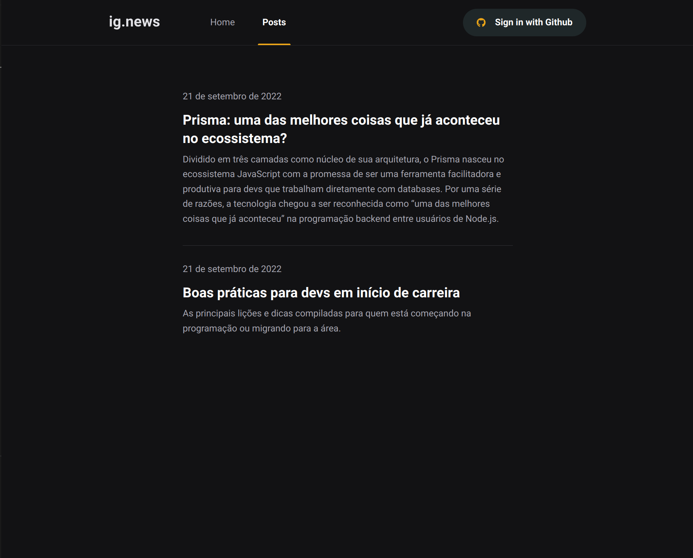
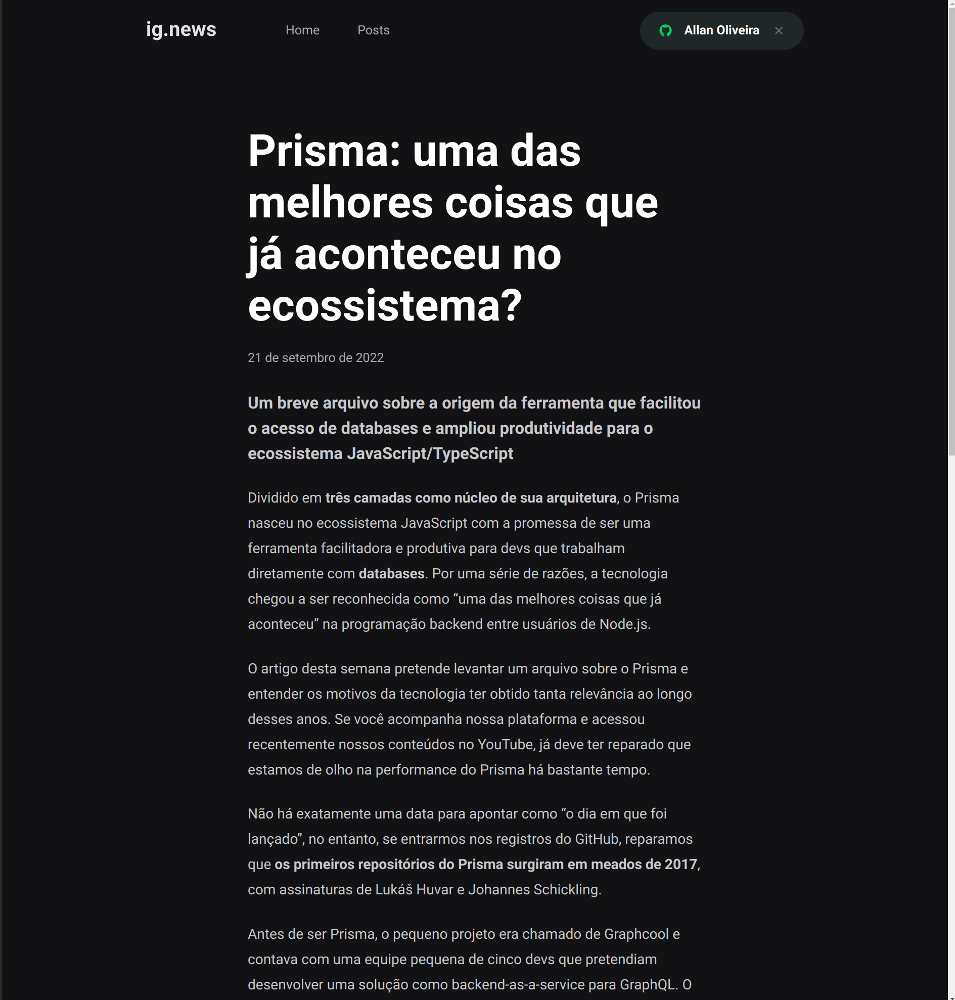

# ig.news


> Este projeto é baseado no módulo de fundamentos de NextJS da [Rocketseat](https://www.rocketseat.com.br/). 

### Aprendizados 😊:

* NextJs
* Node
* React
* Typescript
* Sass
* Server Side Rendering (SSR)
* Static Site Generation (SSG)
* Client Side Rendering (CSR)
* Next-Auth
* Serverless
* API Routes
* FaunaDB
* Stripe
* Webhooks
* Prismic CMS

<!-- - [x] .
- [x] Página de detalhes e card de pokemons feitas mobile first.
- [x] Paginação por rolagem infinita.
- [ ] Adcionar mais detalhes a página de detalhes.
- [ ] Implementar a utilização da library Chakra UI -->


👏🏿😊💡💣🖤❤️
##  Páginas do projeto:
### Home:
### Página de Posts:
### Página de Preview de Post (Usuário não assinante):
### Página do Post (Usuário assinante):


## 🚀 Instalando o ignews:

* Verifique se o Yarn ou NPM está instalado e na versão mais recente executando o comando`yarn --version` ou `npm --version`.


Para instalar o ignews, siga estas etapas:

Linux e macOS:
```
yarn install
```
ou
```
npm install
```

Configure as váriaveis de ambiente (.env):
```
# Stripe 
NEXT_PUBLIC_STRIPE_PUBLIC_KEY=SUA_API_PUBLICA_DO_STRIPE
STRIPE_SECRET_KEY=SUA_KEY_DA_API_DO_STRIPE
STRIPE_WEBHOOK_SECRET=SUA_KEY_DO_STRIPE_CLI

# Github
GITHUB_CLIENT_ID=SEU_ID_USUARIO_GITHUB
GITHUB_CLIENT_SECRET=SUA_KEY_DO_GITHUB

# FaunaDB
FAUNADB_KEY=SUA_KEY_DO_FAUNA_DB

# Redirect URL
STRIPE_SUCCESS_URL=http://localhost:3000/posts
STRIPE_CANCEL_URL=http://localhost:3000/

# Prismic
PRISMIC_ACCESS_TOKEN=SUA_KEY_DO_PRISMIC
```

Instale o Stripe CLI: [Link](https://stripe.com/docs/stripe-cli)

Faça login no stripe cli através do comando
```
stripe login
```

## ☕ Usando o ignews:

Para usar rodar o ignews execute o comando :
```
yarn dev
```
ou
```
npm dev
```
  Escutando eventos de pagamento ou cancelamento de assinatura no Stripe:
```
  stripe listen --forward-to localhost:3000/api/webhooks
```


[⬆ Voltar ao topo](#ig.news)<br>
